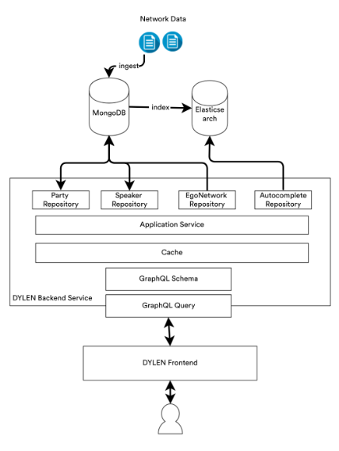

# About

DYLEN Tool was developed as part of the [DYLEN Project](https://dylen.acdh.oeaw.ac.at/) and aims to assist researchers
in gaining insights to the dynamics of the Austrian German lexicon in the last 20 years and to measure the influence of
politicians on language change by visualizing lexical networks.

This repository hosts the backend part of the application, the Frontend part can be found [here](https://github.com/acdh-oeaw/dylen-tool)

# Architecture

# Build & Run 
## Build
    ./gradlew build
## Run
    java -jar build/libs/dylen-ego-network-service

# Example GraphQL Queries

[GraphQL Examples](https://gitlab.com/acdh-oeaw/dylen/dylen-ego-network-service/-/tree/master/src/test/resources)

# RUN DYLEN EGO NETWORK SERVICE WITH DOCKER IMAGE

    docker pull registry.gitlab.com/acdh-oeaw/dylen/dylen-ego-network-service

    docker run -p 5000:5000 -t registry.gitlab.com/acdh-oeaw/dylen/dylen-ego-network-service

Endpoint is <code>http://localhost:5000/graphql</code>

# References
* [Spring boot application.properties](https://docs.spring.io/spring-boot/docs/current/reference/html/application-properties.html#application-properties.data)
